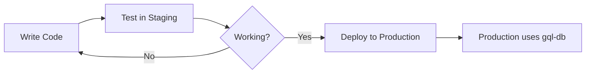

# 🚀 Quick Start Guide - Staging Environment

## TL;DR - Get Started in 3 Steps

### 1️⃣ Create Environment Files
```bash
cp env.staging.template .env.staging
cp env.production.template .env.production
```

Then edit both files to replace placeholder values with your actual credentials.

### 2️⃣ Verify & Migrate
```bash
npm run verify:staging    # Check setup
npm run migrate:staging   # Copy production → staging
```

### 3️⃣ Start Testing
```bash
npm run dev:staging       # Run with staging database
```

---

## 📝 Essential Commands

| What You Want | Command | Database Used |
|---------------|---------|---------------|
| Test features safely | `npm run dev:staging` | staging-amoyan |
| Run production locally | `npm run start:production` | gql-db |
| Normal development | `npm run dev` | (from .env) |
| Copy prod → staging | `npm run migrate:staging` | - |
| Check setup | `npm run verify:staging` | - |

---

## 🗄️ Database Overview

```
MongoDB Atlas Cluster (FREE)
├── gql-db (PRODUCTION)          ← Your live data
└── staging-amoyan (STAGING)     ← Test here safely
```

---

## ⚡ Common Tasks

### Refresh Staging with Latest Data
```bash
npm run migrate:staging
```

### Test a New Feature
```bash
npm run dev:staging
# Test your feature in the browser
# Make changes, test, iterate
```

### Check Current Database Connection
Look at the console output when starting:
- Staging: `✅ Connected to database at staging-amoyan`
- Production: `✅ Connected to database at gql-db`

---

## 🎯 Your Workflow



1. **Write** your features
2. **Test** with `npm run dev:staging`
3. **Iterate** until satisfied
4. **Deploy** to Firebase (will use production DB)

---

## 🛡️ Safety First

✅ **Safe Operations** (Staging)
- `npm run dev:staging`
- `npm run start:staging`

⚠️ **Production Operations** (Be Careful!)
- `npm run start:production`

💡 **Tip:** Always check `NODE_ENV` in console output!

---

## 📚 Need More Details?

See **[STAGING_SETUP_GUIDE.md](./STAGING_SETUP_GUIDE.md)** for:
- Detailed setup instructions
- Troubleshooting guide
- Environment variable explanations
- Full command reference

---

## 🆘 Quick Troubleshooting

| Problem | Solution |
|---------|----------|
| Can't connect to DB | Check `.env.staging` MongoDB URI |
| Wrong database | Check `NODE_ENV` in console |
| Migration fails | Run `npm run verify:staging` |
| Missing env file | `cp env.staging.template .env.staging` |

---

**Ready to test? Run `npm run verify:staging` to begin! 🎉**


